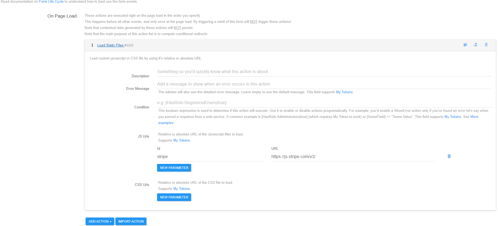
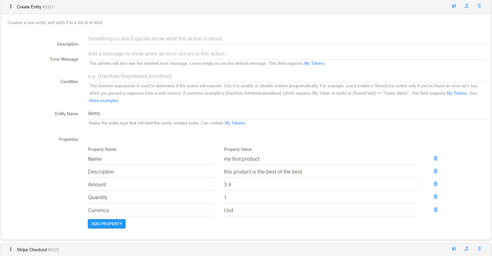
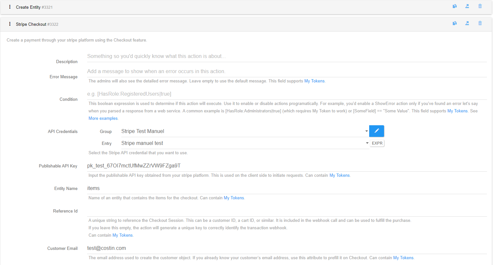
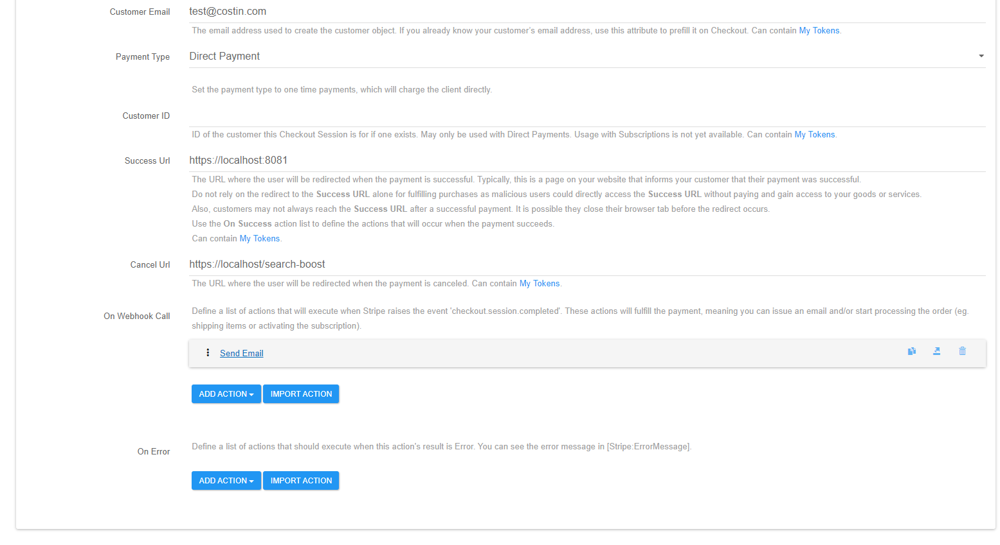
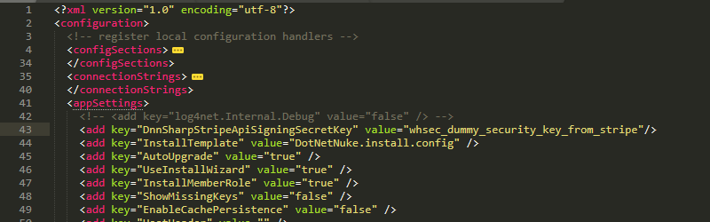

# **Stripe Checkout Action**

## **Introduction**

Starting in September 2019, a new regulation called [Strong Customer Authentication (SCA)](https://stripe.com/docs/strong-customer-authentication) requires businesses in Europe to request additional customer authentication for online payments. Using the new Payment Intent and Setup Intent APIs, Checkout fully supports SCA (including exemption logic) and ensures that you only ask customers to provide additional authentication when strictly necessary.

Starting with [Stripe 5.0.27](https://www.dnnsharp.com/download?p=STRIPE&v=05.00.27) there is a new action named 'Stripe Checkout' which implements the *Client and server integration* from Stripe.

## **Requirements**

- Stripe.js loaded on page, hence, the action can be used only with [ActionForm](/action-form/README.md) and [ActionGrid](/action-grid/index.md) products.
- The full integration require Stripe Webhooks having minimum **version 2019-08-14**.
- If you plan to use [ActionForm](https://www.dnnsharp.com/dnn/modules/action-form-builder) we recommend builds greater than 5.0.709 as it comes with a new action named **Load Static Files** which easily loads any JavaScript or CSS file.

## **Getting Started**

In order to successfully integrate with the Checkout payments from Stripe, you need to configure both Stripe and DNN as presented below.

### **Stripe Configuration**

1. In [Stripe Dashboard](https://dashboard.stripe.com/test/dashboard) you need to configure API keys, on [this page](https://dashboard.stripe.com/test/apikeys)

2. A webhook on [Developers > Webhooks](https://dashboard.stripe.com/test/webhooks) page with version 2019-08-14, pointing to ``https://<Your_Instance_URL>/API/DnnSharp/Stripe/Payment/FullfillPayment``
for DNN versions 9.0.0 and above or
 ``https://<Your_Instance_URL>DesktopModules/DnnSharp/Stripe/API/Payment/FullfillPayment`` for DNN 8.0.4

3. Also, the '**Signing Secret**' of the webhook is required to authenticate the Stripe calls, so note it down because we will add it to DNN web.config file later.

### **DNN Configuration**

1. Add the recommended version of ActionForm module on a page.

2. Scroll to the 'Form Events' section and on the **On Page Load** event add a **Load Static Files** action.
    - Click 'New Parameter' of the **JS Urls** parameter
    - Type 'stripe' on the **Id** column and **https://js.stripe.com/v3/** in the **URL** column.

3. Add a form button and the **On Click Handler** section add the following actions:
    - **Create Entity** action configured as follows:
        - This will hold the items we need to pay for. Using this action you create only one item in an entity. In real-world cases most probably you will load them from SQL with the 'Load Entites From SQL' or 'Load Entities (JSON)'. You can use ActionGrid default entities too, but be sure to respect the names presented below in the 'Properties' parameter as those names are required.
        - **Entity Name**: let's call it '**items**'
        - **Properties**:
            - In the **Property Name** column you need to add 5 different lines with the following keys: **Name**, **Description**, **Amount**, **Quantity**, **Currency** . If any of these keys are missing an exception will be thrown when you click the button and the submit will fail.
            - In the **Property Value** column add some dummy values for each key. You can find more on the [Stripe Documentation](https://stripe.com/docs/api/checkout/sessions/create#create_checkout_session-line_items)

    - **Stripe Checkout** action from the **Stripe** group:
        - This action creates a Checkout Session in Stripe for direct payments or for subscriptions and then redirects the user to stripe Payment page.
        - **Credentials**: Set your stripe API Secret Key securely in CredentialStore.
        - **Publishable API Key**: set your publishable API key obtained from Stripe. This key is used on the client side (browser) to trigger the checkout redirect.
        - **Entity Name**: set the entity name from the **Create Entity** action, namely '**items**'. This will load the item described in the previous action.
        - **Reference Id**: A unique string to reference the Checkout Session. This can be a customer ID, a cart ID, or similar. It is included in the webhook call and can be used to fulfill the purchase. If you leave this empty, the action will generate a unique key to correctly identify the transaction **webhook**.
        - **Customer Email**: If you know the customer email, you can input it here and it will be prefilled on the Stripe checkout page, otherwise Stripe will ask for the customer email.
        - **Payment Type**: Select **Direct Payment**. You can see that here you have 2 options:
            - 'Direct Payment' which is a one time payment.
            - 'Subscription' which will subscribe the user to a plan created before in Stripe or using the **Create Plan** action.
                - Note that these two options require a different format for the input entity! The way we configured the previous entity is the format for **Direct Payment**. We will detail below the required entities for each type.
        - **Customer ID**: ID of the customer this Checkout Session is for if one exists. May only be used with Direct Payments. Usage with Subscriptions is not yet available. Leave empty and Stripe will automatically create a new customer in the platform.
        - **Success URL**: The URL where the user will be redirected when the payment is successful. Typically, this is a page on your website that informs your customer that their payment was successful. Do not rely on the redirect to the Success URL alone for fulfilling purchases as malicious users could directly access the Success URL without paying and gain access to your goods or services. Also, customers may not always reach the Success URL after a successful payment. It is possible they close their browser tab before the redirect occurs. Use the **On Webhook Call** action list to define the actions that will occur when the payment succeeds.
        - **Cancel URL**: The URL where the user will be redirected when the payment is canceled.
        - **On Webhook Call**: Define a list of actions that will execute when Stripe raises the event '**checkout.session.completed**' by calling an API. These actions will be used to fulfill the payment, meaning you can issue an email and/or start processing the order (eg. issue an email, shipping items, activating the subscription, etc). We can add a 'Send email' action for now. The tokens you can use here are ``[Stripe:SessionRawResponse]`` which will output the Stripe 'Session' object; the ``[Stripe:SessionId]`` which holds the session ID generated by Stripe. **Note that final actions are not supported!**
        - **On Error**: Define a list of actions that should execute when this action's result is error, thrown at creating the Session for the checkout. You can see the error message in the token ``[Stripe:ErrorMessage]``.

4. In order for wehbooks to work, you need to set in DNN web.config the 'Signing Secret' obtained from Stripe > Developers > Webhook > **your_webhook**. Copy your 'Signing Secret' then add it to web.config under
**//configuration/appSettings** the following line:

```xml
     <add key="DnnSharpStripeApiSigningSecretKey" value="Your_Signing_Secret_Here"/>
```

We will read this key to authenticate the webhook calls from Stripe.

## **Parameter Details**

1. In the **Credentials** field you need to store the API Secret key obtained from Stripe Dashboard, under [Developer](https://dashboard.stripe.com/test/apikeys) section. Make sure to create and use **test** credentials first.

2. The **Publishable API Key** parameter requires to copy the key from the same page. This key is used by Stripe.js to validate the Session Checkout created earlier.

3. The **Payment Type** parameter lets you choose between a direct payment and a subscription.

    - **Direct Payment** option requires an entity which holds items with the following properties (columns):
        - Name - product name
        - Description - product description
        - Amount - decimal value provided in full units! Not cents! eg. 3.4$ instead of 340cents
        - Currency - three-letter ISO code of one of the allowed currencies by Stripe. See [Stripe documentation](https://stripe.com/docs/currencies)
        - Quantity - integer value holding the number of the items of current product

    - For the **Subscription** option you need to provide an entity with the properties:
        - PlanId - created with 'Create Product' action or directly from Stripe.
        - Quantity - integer value holding the number of the items of current type.

4. **On Webhook Call** parameter represent a list of actions that will execute once the payment is approved by Stripe. The [Stripe Webhook](https://stripe.com/onboarding/billing/integration/webhooks) configured in the platform will call your specified URL and execute these actions. The webhook needs to receive a response in maximum 10 seconds, otherwise it will be considered as failed and Stripe will retry again later. Also, if an error occurs, Stripe will receive an error response and will retry again later.
Read more about webooks best practices on [Stripe documentation page](https://stripe.com/docs/webhooks/best-practices#retry-logic). Note that **final actions (eg. 'Display Message') are not supported!**

## **Useful tokens**

The action generates a few tokens in the parameter 'On Webhook Call':

- **`[Stripe:SessionRawResponse]`** - holds the [Session](https://stripe.com/docs/api/checkout/sessions/object) object which you can parse using the 'Parse JSON into Tokens' action to extract more information for complex integrations.
- **`[Stripe:SessionId]`** - holds the SessionId generated when the client was redirected to the Stripe Platform. You can use this to easily identify a session in Stripe Platform.

## **Configuration Examples**

1. ### **On Page Load Example**

    ActionForm Load Static Files Action

    

2. ### **On Submit Button Example**

    Create Entity Action

    

    Stripe Checkout Action

    
    

3. ### **DNN Configuration Example**

    DNN `web.config` File Configuration

    
